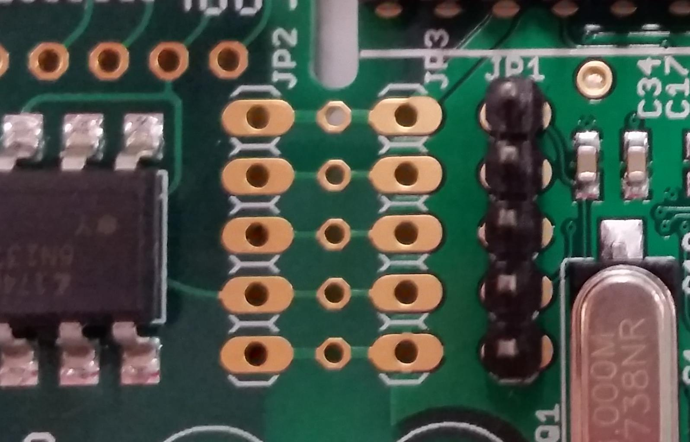

# HOWTO Hookup Development Boards

## USB SWD Connectivity

The SWD signals used to access the ARM coresight features are standard and defined by ARM.
To create those signals a USB to SWD debug probe is used. The specifics of these are different from vendor to vendor.

### ST Link

Typically found as a built in feature of ST development boards.

Also available as a separate USB dongle.
 * http://www.st.com/en/development-tools/st-link-v2.html
 * https://www.adafruit.com/product/2548

### Segger JLINK

Typically found as a built in feature of Nordic development boards.

Also available as a separate USB dongle.
 * https://www.segger.com/products/debug-probes/j-link/models/model-overview/

### CMSIS-DAP

Typically found as a built in feature of Freescale/NXP development boards.

Also available as a separate USB dongle.
 * https://www.tindie.com/products/hnhoan/cmsis-dap-arm-debug-jtagswd-microsd-drag-and-drop/
 * https://1bitsquared.com/products/black-magic-probe

## Connectors

[More information here](http://infocenter.arm.com/help/topic/com.arm.doc.faqs/attached/13634/cortex_debug_connectors.pdf)

The JTAG/SWD connectors to Cortex-M boards are generally of two forms.

 * 0.1" header pins in vendor specific order.
 * A Cortex Debug connector. This is a 10 (2x5) pin connector with 0.05" pin spacing.

The JTAG/SWD dongles generally have a 20 (2x10) pin 0.1" connector that follows the older ARM JTAG/SWD standard.
You need to adapt between the two - it's a re-wiring job.

 * [20 to 10 pin adapter](https://www.adafruit.com/products/2094)
 * [10 pin cable](https://www.adafruit.com/products/1675)

## ST Development Boards

The ST development boards typically have a built-in ST-Link debug probe.
This is the simplest option to use: just connect the board to the host computer using a USB cable.
Its also possible to connect the boards to an offboard debugger.

The ST boards have a 6 pin SWD debug connector.
The JLINK has a 20 pin connector.

 * Board Pin 1 (VDD_TARGET) - No Connect (this is not actually a target reference voltage)
 * Board Pin 2 (SWCLK) - JLINK Pin 9 (SWCLK)
 * Board Pin 3 (GND) - JLINK Pin 4 (GND)
 * Board Pin 4 (SWDIO) - JLINK Pin 7 (SWDIO)
 * Board Pin 5 (NRST) - JLINK Pin 15 (RESET)
 * Board Pin 6 (SWO) - JLINK Pin 13 (SWO) - this is optional
 * Board 3V Vdd - JLINK Pin 1 (VTref)

Leave the ST-Link/Discovery jumpers installed so the debug signals are passed to the Discovery CPU.

## Axoloti Board

The Axoloti boards have a 5 pin SWD debug connector (JP1).

 * JP1 Pin 1 (VCC)
 * JP1 Pin 2 (SWCLK)
 * JP1 Pin 3 (GND)
 * JP1 Pin 4 (SWDIO)
 * JP1 Pin 5 (NRST)

The Axoloti board needs to be used with an external SWD debug dongle connected to these pins.

